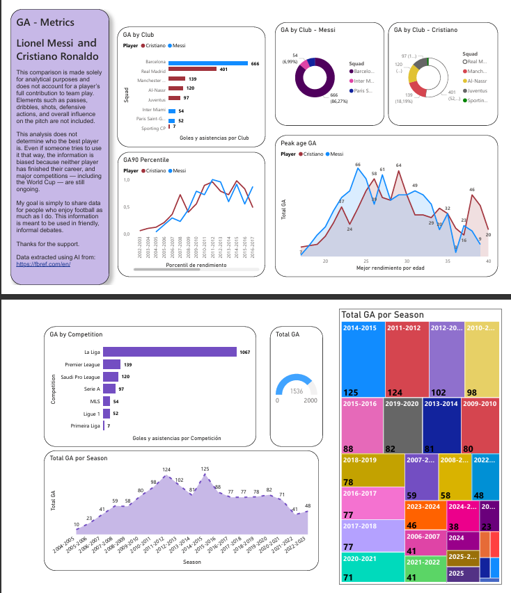

# League Player Data Analysis — BI‑Oriented
Comparative performance analysis of professional football players across leagues, following end‑to‑end Business Intelligence workflows.

# GA Metrics – Lionel Messi & Cristiano Ronaldo  
Comparative Career Analysis (Goals + Assists)

This project presents a data‑driven analysis of the offensive contribution of Lionel Messi and Cristiano Ronaldo throughout their club careers.  
The goal is **not** to determine who is the best player, but to visualize how much both have contributed to football using measurable offensive metrics.

---

## 📊 Project Overview

The analysis focuses on **GA (Goals + Assists)** as the primary metric.  
It includes:

- GA by Club  
- GA by Competition  
- GA by Season  
- GA by Age  
- GA Percentile (per season)  
- Peak Performance Metrics  
- Total GA Accumulated  
- Individual Club Distribution (Messi / Cristiano)  
- Combined Contribution Visuals  

All visuals were created using **Power BI**.

---

## 🎯 Purpose of This Analysis

This comparison is made **solely for analytical and educational purposes**.  
It does **not** represent the full impact of each player on the pitch.

Important notes:

- It does **not** include passes, dribbles, shots, defensive actions, or overall team influence.  
- It does **not** determine who the best player is.  
- The information is **biased by nature**, since neither player has finished their career and major competitions are still ongoing.  
- The intention is to provide data that can be used in **friendly, informal football debates**.

I genuinely hope people enjoy football as much as I do, and that this project contributes to that enjoyment.

---

## Data Source

All data was extracted using AI from:

🔗 https://fbref.com/en/

---

## 🛠️ Tools & Technologies

- **Power BI** – Data modeling & visualization  
- **Python (optional)** – Data cleaning  
- **GitHub** – Version control & documentation  
- **AI-assisted extraction** – Data retrieval from FBRef  

---

## 📁 Repository Structure

/data
Raw data: Lionel Messi - League Clubs.csv and Cristiano Ronaldo - League Clubs.csv
Cleaned data: League Clubs PBIX.pbix
PDF: League Clubs PBIX.pdf

/screenshots
Visualizacion.png

README.md

---

## 📸 Dashboard Preview

---

## 🤝 Contributions

Feel free to open issues or submit pull requests if you want to improve the dataset, add new metrics, or extend the analysis.

---

## ⭐ Acknowledgements

Thanks to the football community for keeping the debate alive.  
And thanks for the support on this project.

# Castellano

# GA Metrics – Lionel Messi & Cristiano Ronaldo  
Análisis de Carrera (Goles + Asistencias)

Este proyecto presenta un análisis visual y estadístico del aporte ofensivo de Lionel Messi y Cristiano Ronaldo a lo largo de sus carreras en clubes.  
El objetivo **no** es determinar quién es el mejor jugador, sino mostrar cuánto han contribuido ambos al fútbol mediante métricas cuantificables.

---

## 📊 Descripción del Proyecto

El análisis se centra en la métrica **GA (Goles + Asistencias)**.  
Incluye visualizaciones como:

- GA por Club  
- GA por Competición  
- GA por Temporada  
- GA por Edad  
- Percentil GA90 por temporada  
- Picos de rendimiento  
- GA total acumulado  
- Distribución individual por club (Messi / Cristiano)  
- Visuales combinados del aporte total  

Todas las visualizaciones fueron creadas en **Power BI**.

---

## 🎯 Propósito del Análisis

Este proyecto tiene fines **analíticos y educativos**.  
No representa el impacto completo de cada jugador dentro del juego.

Puntos importantes:

- No se incluyen pases, regates, tiros, acciones defensivas ni influencia táctica.  
- No pretende determinar quién es “mejor”.  
- La información es **parcial por naturaleza**, ya que ninguno ha terminado su carrera y aún quedan competiciones importantes por disputarse.  
- El objetivo es aportar datos para **debates informales y amistosos** entre aficionados al fútbol.

Espero que quienes vean este proyecto disfruten del fútbol tanto como yo.

---

## 🧠 Fuente de Datos

Los datos fueron extraídos mediante IA desde:

🔗 https://fbref.com/en/

---

## 🛠️ Herramientas Utilizadas

- **Power BI** – Modelado y visualización de datos  
- **Python (opcional)** – Limpieza y preparación de datos  
- **GitHub** – Control de versiones y documentación  
- **Extracción asistida por IA** – Obtención de datos desde FBRef  

---

## 📁 Estructura del Repositorio

/data
Raw data: Lionel Messi - League Clubs.csv and Cristiano Ronaldo - League Clubs.csv
Cleaned data: League Clubs PBIX.pbix
PDF: League Clubs PBIX.pdf

/screenshots
Visualizacion.png

README.md

---

## 📸 Vista Previa del Dashboard

---

## 🤝 Contribuciones

Si deseas mejorar el dataset, añadir nuevas métricas o ampliar el análisis, puedes abrir un issue o enviar un pull request.

---

## ⭐ Agradecimientos

Gracias a la comunidad futbolera por mantener vivo el debate.  
Y gracias por el apoyo a este proyecto.
