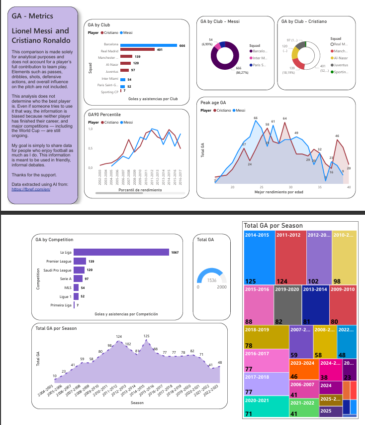

# League Metrics – Lionel Messi & Cristiano Ronaldo

### Comparative Career Analysis (Goals + Assists)

**GA (Goals + Assists)** represents the total number of goals scored and assists recorded by each player. In this project, it is used as the primary metric to analyze and compare the offensive contribution of Lionel Messi and Cristiano Ronaldo throughout their club careers, from the beginning of their professional careers up to the period preceding the 2026 World Cup.

---

## 📸 Dashboard Preview

---

## 📊 Project Overview

The analysis focuses on **GA (Goals + Assists)** as the primary metric.  
It includes:

- GA by Club  
- GA by Competition  
- GA by Season  
- GA by Age  
- GA Percentile (per season)  
- Peak Performance Metrics  
- Total GA Accumulated  
- Individual Club Distribution (Messi / Cristiano)  
- Combined Contribution Visuals  

All visuals were created using **Power BI**.

---

## 🎯 Purpose of This Analysis

This comparison is made **solely for analytical and educational purposes**.  
It does **not** represent the full impact of each player on the pitch.

Important notes:

- It does **not** include passes, dribbles, shots, defensive actions, or overall team influence.  
- It does **not** determine who the best player is.  
- The information is **biased by nature**, since neither player has finished their career and major competitions are still ongoing.  
- The intention is to provide data that can be used in **friendly, informal football debates**.

I genuinely hope people enjoy football as much as I do, and that this project contributes to that enjoyment.

---

## Data Source

All data was extracted using AI from:

🔗 https://fbref.com/en/

---

## 🛠️ Tools & Technologies

- **Power BI** – Data modeling & visualization  
- **GitHub** – Version control & documentation  
- **AI-assisted extraction** – Data retrieval from FBRef  

---

## 📁 Repository Structure

/data
Raw data: Lionel Messi - League Clubs.csv and Cristiano Ronaldo - League Clubs.csv
Cleaned data: League Clubs PBIX.pbix
PDF: League Clubs PBIX.pdf

/screenshots
Visualizacion.png

README.md

## 🤝 Contributions

Feel free to open issues or submit pull requests if you want to improve the dataset, add new metrics, or extend the analysis.

---

## ⭐ Acknowledgements

Thanks to the football community for keeping the debate alive.  
And thanks for the support on this project.
